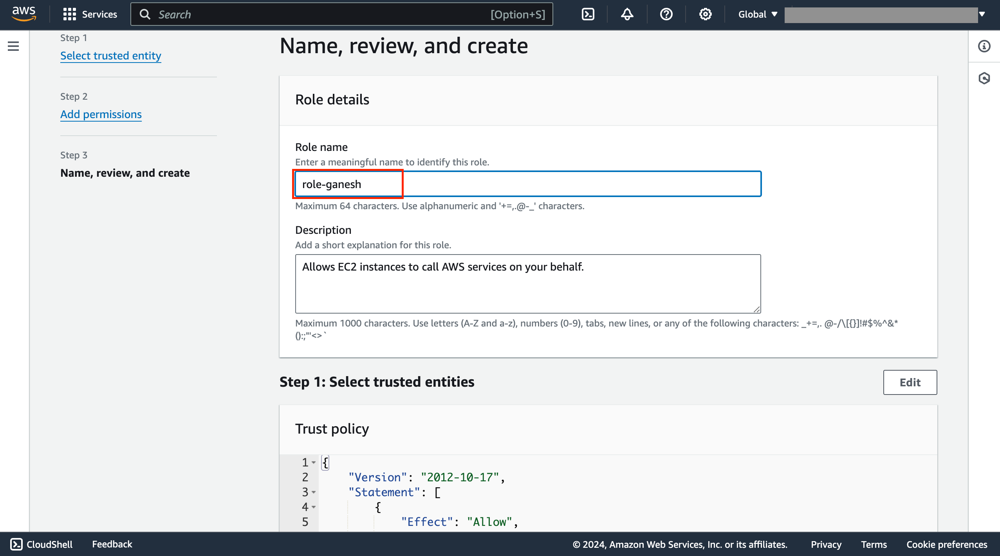
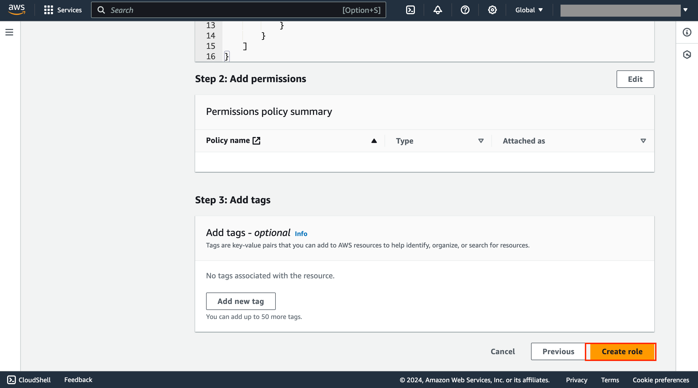
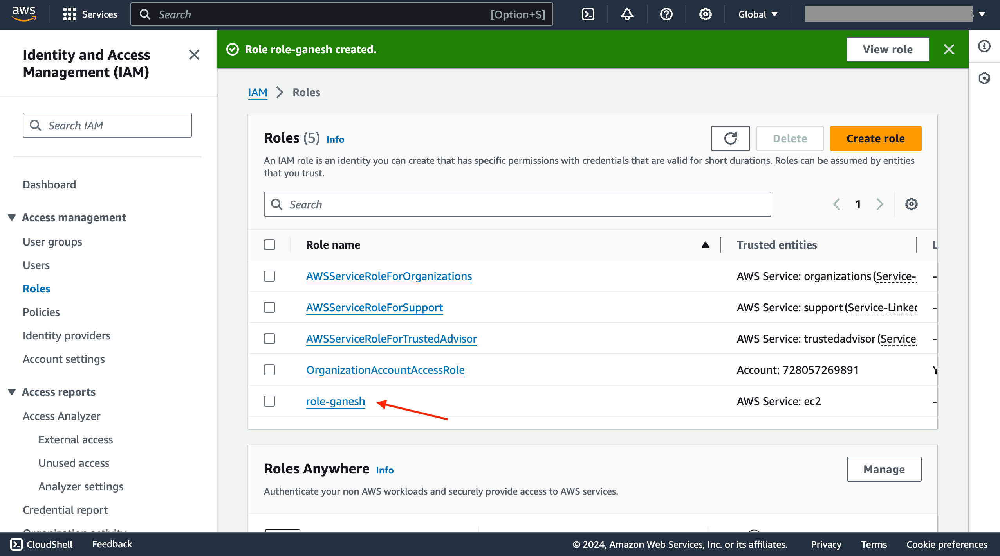

# Exercise.4
**Attaching policies to the role**

## Task.1

In **Role name** section provide name for your role

## Task.2

Then scroll down and click on **create role**

## Task.3

Finally your **Role** will be created, and can view in  existing role list

<validation step="0e0351ca-4f0a-46dc-8446-29d4be17cb58" />
